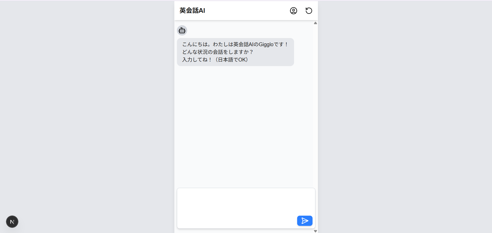
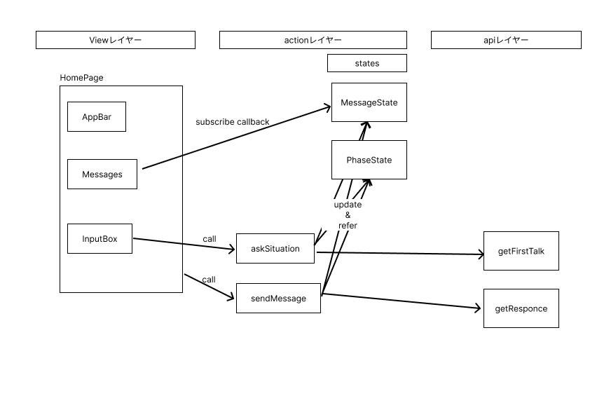

# AI英会話パートナー「Gigglo」

本サービスは、英語学習者向けにAIを活用した会話練習サービスを提供します。<br>
ユーザーは自分のレベルや目的に合わて、欲しい状況で、AI英会話パートナーと対話することで、実践的な英語コミュニケーション能力を向上させることができます。



### 2. 主要機能
- 会話する状況設定
- テキストベースの会話
- 送信した英語文の添削及びアドバイス

## セットアップ

### 1. リポジトリのクローン
```
git clone https://github.com/yoshiInGit/eng_learn
cd eng_learn
```

### 2. パッケージのインストール
```
npm install
# または
yarn install
```

### 3. 環境変数ファイルの作成
.env.local ファイルをプロジェクトルートに作成し、必要な環境変数を記述します。

```
# .env.local
GEMINI_KEY = ******
```

### 4. 開発サーバーの起動
```
npm run dev
# または
yarn dev
```

<br>
<br>

## システム構成
#### 3.1 システム構成
- フロントエンド・バックエンド：Next.js
- デプロイ：Vercel
- AI：大規模言語モデル（Gemini-2.0-flash）

### 全体概要


システムは大きく３つの部分に分かれている
- Viewレイヤー：アプリの見た目を決定する。主にReactコンポーネント
- Actionレイヤー：アプリの機能をつかさどる。関数の形式でロジックなどはここに書かれる。<br>
内部にアプリの状態を記憶するStateが存在する
- APIレイヤー：API関連が書かれたレイヤー

#### アプリの処理の流れ
- 前提
Actionレイヤー内部にはアプリの状態を記憶するStateが存在する。<br>
Stateはシングルトンで記述され、アクセスすることでアプリの状態を記憶・参照させることができる。<br>
さらにStateにはコールバック関数を登録させることができる。<br>
これはStateの状態が変更された時に明示的によびだされ、Viewレイヤーなどが画面の状態を更新をしたいときに利用される

1. ViewレイヤーはStateに画面更新用のコールバック関数を登録する
2. VIewレイヤーはユーザーの行動に基づいて、Actionレイヤーの関数を呼び出す。
3. ActionレイヤーはStateの更新及び通知、APIの呼び出しを行う
4. Viewレイヤーは登録したコールバック関数により、画面を更新する

<br>
<br>

## プロンプト
### 会話開始プロンプト
```
これからあなたと私で与えられた状況で英語で会話をします。
まずあなたから会話をはじめてください。
会話はできるだけ質問になるようにしてください。
会話では"/"を使って文を構成せず、適当に確定した文にしてください。
<example>
Good morning, sir.
</example>

<situation>
${situation}
</situation>

ASSISTANT:
```

出力例
```
Good morning. May I see your boarding pass and ID, please?
```
```
Good morning. May I see your boarding pass and photo ID, please?
```

### 応答プロンプト
```
現在あなたと以下の指定した状況で英語で会話している。
これまでの会話履歴からこの以下のようなユーザーのメッセージが届いた。

このメッセージに対する返答を"message"に書いて。

また、"user message"に文法的な誤り、または不自然な返答がれば日本語で"correction"に訂正して。これまでの"message history"での間違いは無視して。
"user message"が日本語の場合は、英訳して。
何も誤りがなければnullにして。訂正には簡単な解説を入れて
<example>
正: He doesn't like coffee.
三人称単数（He）の現在形では、動詞に "s" をつけるか、"does not" の短縮形 "doesn't" を使います。
</example>

指定したjson形式で返答して

<situation>
${situation}
</situation>

<message history>
${messageHistory}
</message history>

<user message>
${userMessage}
</user message>

<response schema>
{ 
 message : str
 correction : str | null
}
</schema>
```